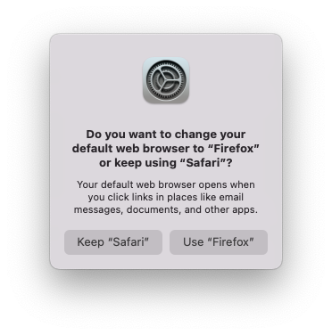

# macOS Default Browser Switcher

This is just a quickly thrown together project to get somewhat acclimated with interop support in .NET. I've never attempted something like this before, so it's mostly just a learning experience to understand how it works and also create my own tool for changing the default browser on macOS.

It also takes advantage of [.NET Native AOT](https://learn.microsoft.com/en-us/dotnet/core/deploying/native-aot), so the compiled executable/binary has no requirement for the .NET runtime and has a faster startup time.

The core of the tool utilizes functions in the:

- [Core Foundation Framework](https://developer.apple.com/documentation/corefoundation)
- [Launch Services API](https://developer.apple.com/documentation/coreservices/launch_services)

Specifically for the purposes of getting and setting the default browser for macOS, I'm using two functions found in the [Launch Services API](https://developer.apple.com/documentation/coreservices/launch_services):

- [`func LSCopyDefaultHandlerForURLScheme(_ inURLScheme: CFString)`](https://developer.apple.com/documentation/coreservices/1441725-lscopydefaulthandlerforurlscheme)
- [`func LSSetDefaultHandlerForURLScheme(_ inURLScheme: CFString, _ inHandlerBundleID: CFString)`](https://developer.apple.com/documentation/coreservices/1447760-lssetdefaulthandlerforurlscheme)

> ❗️ **Heads up**
>
> Both of these functions are **deprecated**. They still _work_, but they can be removed in a future macOS release. There aren't, as far as I'm aware, **any** replacement functions.
>  
> **As of macOS Sonoma (`14.1.2`), they still work.**

## 🏗️ Building

### 🧰 Prerequisites

- A device capable of running macOS.
- [.NET 8 SDK](https://dotnet.microsoft.com/en-us/download/dotnet/8.0)
- Command Line Tools for XCode
  - You can run `xcode-select --install` in a terminal console (**e.g.** _Terminal.app_) to install it.

### 📦 Compiling

In a terminal console (**e.g.** _Terminal.app_), run the following commands:

```bash
# Clone the 'SmallsOnline.MacOS.DefaultBrowser' repo.
git clone https://github.com/Smalls1652/SmallsOnline.MacOS.DefaultBrowser.git

# Enter the 'SmallsOnline.MacOS.DefaultBrowser' directory.
cd ./SmallsOnline.MacOS.DefaultBrowser

# Compile the CLI tool with one of the following commands

# If you're on a Mac that has a M-series chip (Apple Silicon):
dotnet publish ./src/ConsoleApp/ --configuration "Release" --output "./build" --runtime "osx-arm64"

# If you're on a Mac that has an Intel CPU:
dotnet publish ./src/ConsoleApp/ --configuration "Release" --output "./build" --runtime "osx-x64"
```

Once it's finished compiling, the `browserdefault` executable/binary file will be in the `./build` directory.

## 🏃‍♂️ Usage

### Get the current default browser

`./browserdefault`

**Output:**
```
URL Scheme | Bundle ID       
-----------+-----------------
http       | com.apple.Safari
https      | com.apple.Safari
```

### Change the default browser

`./browserdefault {{BROWSER_BUNDLE_ID}}`

Replace `{{BROWSER_BUNDLE_ID}}` with any bundle ID (`CFBundleIdentifier`) for a web browser. These are some of the more common ones:

| Web Browser | Bundle ID |
| --- | --- |
| **Apple Safari** | `com.apple.Safari` |
| **Mozilla Firefox** | `org.mozilla.firefox` |
| **Google Chrome** | `com.google.Chrome` |
| **Chromium** | `org.chromium.Chromium` |
| **Microsoft Edge** | `com.microsoft.edgemac` |

For example, if you wanted to change your default web browser to **Mozilla Firefox**, you can run this:

`./browserdefault "org.mozilla.firefox"`

> ⚠️ **Note**
>
> You will get a prompt, like the one below, when ran. In order for the change to take effect, **you must click on the button for using the browser you specified**.
>
> 

## 🤝 License

This project is licensed under the [MIT License](./LICENSE).
